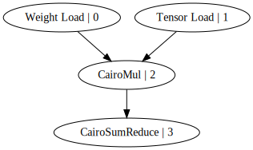

Welcome to the LuminAir Quickstart! 
In this guid, you'll see how to set up a Rust project and run a simple neural network model on a zkVM using LuminAir. 
Follow these steps to get started quickly.

## Prerequisites
**Rust**: Ensure you have Rust installed. If not, install it from [rustup.rs](https://rustup.rs/).

## Step 1: Create a New Rust Project

Start by creating a new Rust project where you'll define your model.

```bash
cargo new luminair_example
cd luminair_example
```

## Step 2: Add Dependencies

Open the `Cargo.toml` file in your project directory and add the required dependencies. 
Replace the existing [dependencies] section with the following:

```toml
[dependencies]
luminair_cairo = { git = "https://github.com/raphaelDkhn/LuminAir" }
luminal = { git = "https://github.com/jafioti/luminal" }
luminal_nn = { git = "https://github.com/jafioti/luminal" }
```

## Step 3: Design Your Model

Next, you'll define a simple neural network model in Rust. 

Open the `src/main.rs` file and replace its contents with the following code:

```rust
use luminair_cairo::CairoCompiler;
use luminal::prelude::*;
use luminal_nn::Linear;

fn main() {
    // Create a new graph
    let mut cx = Graph::new();

    // Randomly initialize a linear layer with an input size of 4 and an output size of 5
    let model = Linear::new(4, 5, false, &mut cx).initialize();

    // Make an input tensor
    let a = cx.tensor(4).set(vec![1., 2., 3., 4.]);

    // Feed tensor through model
    let mut b = model.forward(a).retrieve();

    // Compile the graph on CairoCompiler
    let _ = cx.compile(CairoCompiler::default(), &mut b);

    // Display the graph to see the ops
    cx.display();

    // Execute the graph
    cx.execute();

    // Print the results
    println!("B: {:?}", b.data());
}
```

## Step 4: Run the Project
With the project set up, you can now build and run it.
```bash
cargo run
```

The `display()` method visualizes the computational graph compiled by the LuminAir `CairoCompiler`. 


Each operator node in the graph represents a distinct zk circuit executing on its own zkVM instance (CairoVM in this example). 
This enables multiple execution traces to be proven in **parallel**, enhancing efficiency during the proving phase.

